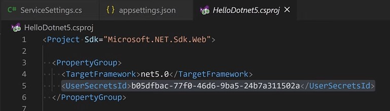

# Microserviços

É um serviço autonomo, com uma única responsabilidade que se comunica com outros serviços para realização de tarefas mais complexas

## Criar um Microserviço

>dotnet new webapi -o NomeDoServico

### Configurações adicionais

Adicionar no arquivo tasks.json para agilizar a compilação no VSCode 

```json
"group": {
	"kind": "build",
	"isDefault": true
}
```

Como fazer com que  o projeto seja iniciado em uma determinada rota (ex: /swagger)

> add in launch.json -> "serverReadyAction"
	- "uriFormat": "%s/swagger"
	
Para evitar que abra um novo browser ao executar Run (util quando estiver desenvolvendo apenas uma API, para testar usando Postman/Insomnia)

> Remover do launch.json a seção "serverReadyAction"

### Objeto *ServiceSettings*

Objeto para buscar e serializar as propriedades que estão no arquivo *appsettings.json*.

```json
"ServiceSettings": {
    "HostAddress": "api.openweathermap.org"
}
```

Por exemplo

```c#
public class ServiceSettings
{
    public string HostAddress;

    public string ApiKey;
}
```

Criar um user-secret
utilizado para armazenar dados que não podem estar expostos no arquivo de configuração.

>dotnet user-secrets init

Esse comando vai criar uma propriedade chamada UserSecretsId dentro do arquivo do projeto (.csproj)



Setar uma configuração para não exibir explicitamente.

>dotnet user-secrets set {classe}:{propriedade} {value}

Por exemplo

>dotnet user-secrets set ServiceSettings:ApiKey {value}

Registrar as configurações no Startup.cs

```c#
services.Configure<ServiceSetting>(Configuration.GetSection(nameof(ServiceSettings)))
```

Sendo *ServiceSettings* o objeto e o nome da configuração a serem registrados.

### Injetar as configurações do appsettings.json no objeto

É necessário criar uma propriedade do tipo definidor para determinada configuração e utilizar do padrão IOption

Após registrar o objeto de configuração no startup, o construtor do objeto terá como parametro a implementação do tipo:

```c#
private readonly ServiceSettings _settings;

public Object(IOptions<ServiceSettings> settings)
{
    this._settings = settings.Value;
} 
```

### Objeto Record

É um tipo de dado que foi adicionado no .NET 5.0 para se trabalhar com tipos imutáveis

### Resiliência do microserviço

Um microserviço deve estar em operação praticamente o tempo inteiro, mas podem haver casos que causam a queda do mesmo.

Resiliência é preparar o serviço para conseguir retornar ao seu estado de operação normal caso se depare com algum problema.

## Como aumentar a resiliência do serviço

### WaitAndRetryAsync
  
Uma das formas é adicionar o Transient http error policy ao registrar o Client no Startup.cs

>Adicionar package Nuget Polly: dotnet add package Microsoft.Extensions.Polly

```c#
services.AddHttpClient<WeatherClient>()
        .AddTransientHttperrorPolicy(builder => builder.WaitAndRetryAsync(10, retryAttempt => TimeSpan.FromSeconds(Math.Pow(2, retryAttempt))))
```

>O trecho ```retryAttempt => TimeSpan.FromSeconds(Math.Pow(2, retryAttempt)))``` é o chamado *Exponential backoff*
Utilizado para evitar congestionamento da rede, é um algoritmo usado para espaçar exponencialmente as retransmissões do mesmo bloco de dados.

### CircuitBreaker

Outro método é chamado de *Circuit breaker*.

A diferença dele para o *Exponential backoff* é que esse utiliza de um espaço de tempo fixo, e a quantidade de tentativas são definidas (ex: 3 tentivas);

```c#
services.AddHttpClient<WeatherClient>()
        .AddTransientHttperrorPolicy(builder => builder.WaitAndRetryAsync(10, retryAttempt => TimeSpan.FromSeconds(Math.Pow(2, retryAttempt))))
        .AddTransientHttperrorPolicy(builder => builder.CircuitBreaker(3, TimeSpan.FromSeconds(15)));        
```

Dependendo do contexto, é uma boa opção pois não sobrecarrega o servidor com muitas tentativas enão deixa o client esperando.

### HealthCheck

É basicamente um endpoint que qualquer serviço externo que esteja enxergando possa consumir.
Geralmente o orquestrador (ex: kubernetes) irá "pingar" esse endpoint para verificar o status do serviço.

No *ConfigureServices* Startup.cs, registre os HealthChecks;

```c#
services.AddHealthChecks();
```

Depois é necessário atualizar os Middleware, para adicionar as rotas para a checagem do status.

```c#
app.UseEndpoints(endpoints =>
{
    endpoints.MapControllers(),
    //Adiciona o Middleware para heath checks. O nome "health" é uma convenção muito utilizada, então vou seguir o padrão
    endpoints.MapHealthChecks("/heath") 
});
```
#### Custom HealthCheck

Criar uma classe que irá herdar a interface IHealthCheck

Exemplo:
```c#
public class ExternalEndpointHealthCheck : IHealthCheck
{
    //Implementação da interface IHealthCheck
    public Task<HealthCheckResult> CheckResultAsync(HealthCheckContext context,)
    {
        //Implementação
    }

}
```

depois é necessário registrar a classe nos serviços

```c#
services.AddHealthChecks()
    .AddCheck<ExternalEndpointHealthCheck>("OpenWeather");
```

Para cada serviço que precise se comunicar, é necessário registrar um HealthCheck, com nomes diferentes

## Logging

Para o serviço registre logs em formato JSON, é necessário alterar a criação do HostBuilder.

No arquivo Program.cs, extenda o CreateDefaultBuilder adicionando a extensão ConfigureLogging

```c#
public static IHostBuilder CreateHostBuilder(string[] args) => 
    Host.CreateDefaultBuilder(args)
        .ConfigureLogging((context, logging) => 
        {
            //Aqui ele verifica se o ambiente é produção e caso seja true o serviço irá gerar logs no formato JSON, caso contrário exibirá no console simples
            if(context.HostingEnvironment.isProduction())
            {
                //Remove o console simples
                logging.ClearProviders();
                logging.AddJsonConsole();
            }
        })
```

<!-- 
## Desenvolvimento do projeto
A seguir está a lista de tarefas a serem desenvolvidas. 

* Configurar ambiente
* Criar configurações do serviço (*ServiceSettings*)
* Criar um Client responsável por consumir os dados da API (*WeatherClient*)
* Criar um controller ou alterar o gerado pelo .NET automaticamente que vai chamar o Client e retornar os dados -->


